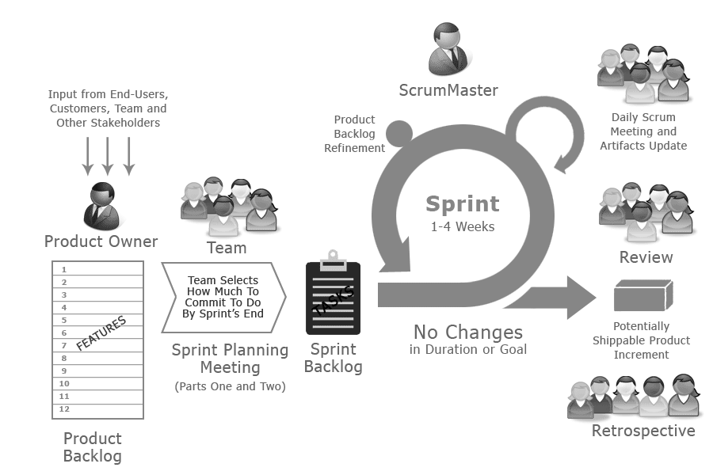

1. Repeat and check homework
2. Software dev. methodologies: Waterfall, Agile

## 1. Repeat and check homework

## 2. Software dev. methodologies: Waterfall, Agile

SDLC - software development lifecycle
STLC - software testing lifecycle

Requirements:
1. Customer requirements
2. System requirements
3. Programming specification 

SRS (Software Requirement Specification)
https://slcc.pressbooks.pub/technicalwritingatslcc/chapter/software-requirements-specification-srs/

build v0.0.1
> registration fn

build  v0.0.2
> registration fn (old)
> fixed bugs
> login fn

build  v0.0.3
> registration fn (old)
> login fn (old)
> fixed bugs
> item catalog fn  

Waterfall: Linear and sequential. Each phase (e.g., Requirements → Design → Implementation → Testnig → Maintenance) must be completed before the next begins.  

Agile: Iterative and incremental. Development is done in small cycles (sprints), and features are delivered continuously.  

https://en.wikipedia.org/wiki/Agile_software_development   

Free books form GitHub:

https://github.com/gaurav2013/Books 
https://github.com/PacktPublishing/Agile-Project-Management   
https://github.com/PacktPublishing/Becoming-an-Agile-Software-Architect  

