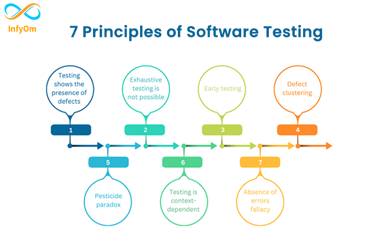

1. Repeat and check homework
2. Seven testing principles
3. Boundary values
4. Pesticide paradox
5. Register bugs into Jira

## 1. Repeat and check homework

## 2. Seven testing principles  
https://betterqa.co/the-7-principles-of-testing/  

## 3. Boundary values

https://www.alphabin.co/blog/boundary-value-analysis-in-software-testing  

ex:
[0,10] - 0,-1, 1, 10, 9, 11
[0,1000] - 0,-1, 1, 1000, 999, 10001, 4999

Balsavimo biuletenis (balsuoti gali asm. 18-50 m):
balsuoti gali: 
1. amzius[18]
2. amzius[19]?
3. amzius[49]?
4. amzius[50]

balsuoti negali: 
1. amzius[17]
2. amzius[51]

### Exercises:
[Life period](https://www.testdome.com/questions/quality-assurance/life-period/137823)
[Thermostat](https://www.testdome.com/questions/quality-assurance/thermostat/137821)
[Deposit](https://www.testdome.com/questions/quality-assurance/deposit-interest/137827)

## 4. Pesticide paradox

https://bugbug.io/blog/software-testing/pesticide-paradox/  

The Pesticide Paradox in software testing is a principle stating that if the same set of test cases is executed repeatedly, they will eventually fail to detect new defects.  

This concept, introduced by Boris Beizer in Software Testing Techniques, draws an analogy to how insects develop resistance to pesticides when the same chemicals are used repeatedly.

## 5. Register bugs into Jira

**1. Title**
Pavadinimas turi atsakyti į sekančius klausymus:
     * kas atsitiko
     * kurioje vietoje
     * prie kurių aplinkybių

pvz.E2E: 
    "Amount of 'followers' is missing on the users account page when user logged in." 

pvz.API:
    Standartinė situacija, kuri neturi specialių aplinkybiu.
    Nors galima pažymėti, kad "when token is present" arba "when user logged in"
    "Internal Server Error with 200 upon sending GET /admin/users"

**2. Description: steps to reproduce**

Pre-requisites. Pvz.: existing account with followers
pvz.E2E:
    1st stp. Navigate to users page
    2nd stp. Observe amount of followers

    Expected: Amount of followers is visible
    Actual: Amount of followers is not visible

Pre-requisites. Pvz.: existing few users
pvz.API:
    1st stp. Send GET request to /admin/users
    2nd stp. Observe response

    Expected: list of users, response code 200
    Actual: message 'internal server error'  with response code 200

**3. Environment**
    Pvz:
        Chrome version 133.0.6943.142
        QA environment
        Postman

**4. Build version**

**5. Severity**

