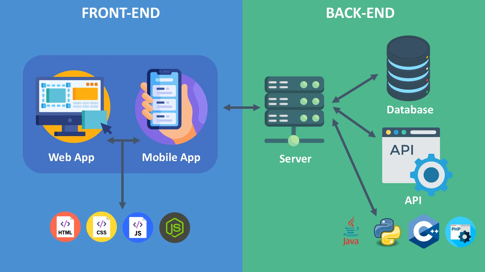
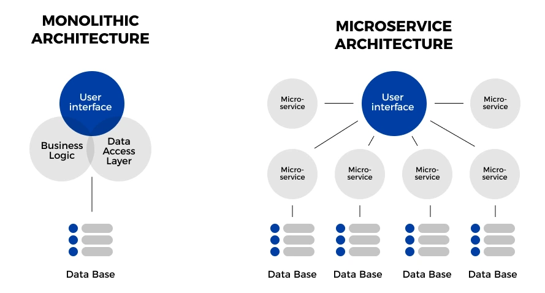

1. Repeat and check homework
2. FE vs BE
3. System integrations
4. REST API
5. Postman

## 1. Repeat and check homework

## 2. FE vs BE

### Client - Server architecture   

### Monolithic vs. Microservice architecture  

### Microservice architecture  

EX: Shopping website
1. registration/login
2. item catalog
3. cart
4. payment
5. item delivery
6. user metics/analytics

## 3. System integrations
API - application programming interface
UI
CLI

API architecture styles:
***RESTful API***
GraphQL
SOAP API
gRPC

JSON - java script object notation  
https://www.json.org/json-en.html  

CRUD -> Create, Read, Update, Delete

***RESTful API***

***STATELESS***

CLIENT
Protocol: HTTP/HTTPS
Request message:
1. Starting line
   1. http method: GET (Read), POST(Create), PUT and PATCH (Update), DELETED (Delete)
   2. url: baseUrl + endpoint
2. Header -> metadata
3. body

SERVER
Protocol: HTTP/HTTPS
Response message:
1. Starting line
   1. response code: 100, 200, 300, 400, 500
2. Header -> metadata
3. body -> JSON

https://learn.microsoft.com/en-us/azure/architecture/best-practices/api-design  
https://zuplo.com/blog/2025/03/12/common-pitfalls-in-restful-api-design  

## 4. REST API

[ondanto api](https://verifid.ondato.com/swagger/index.html)  
[railbank api](https://docs.railsr.com/)  
[Post api](https://postapi.lt/documentation)  
[LP api](https://www.post.lt/api-verslui)  
[Petstore api](https://petstore.swagger.io/) 
[jsonplaceholder](https://jsonplaceholder.typicode.com)  

## 5. Postman
